# Waterline — Android

The Android counterpart to the web app at **<https://hanifedma.com/waterline/>**.

Same fasts, same account, same Firestore documents — begin a fast on your
phone and the browser has it about a second later, and the other way round.

Built with Kotlin and Jetpack Compose. No Room, no DI framework, no networking
library: the whole thing is Compose, Firebase and about 4,000 lines of Kotlin.

Plus the one thing a web page fundamentally cannot do — **a fasting clock that
keeps counting on your lock screen for three days with the app closed.**

---

## What it looks like

| Timer | Log | Body |
|:---:|:---:|:---:|
| 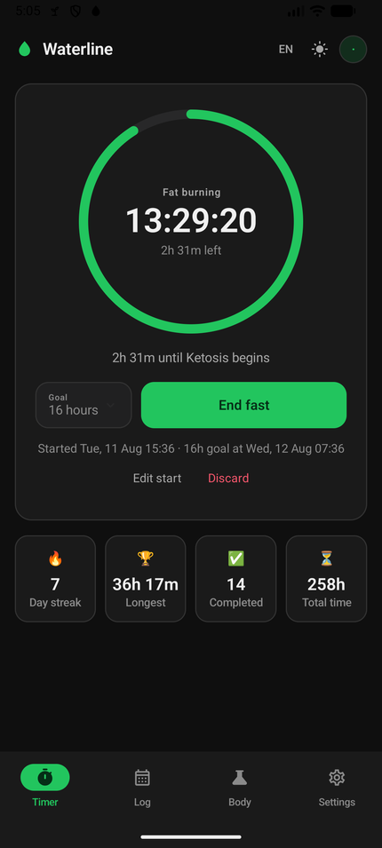 | 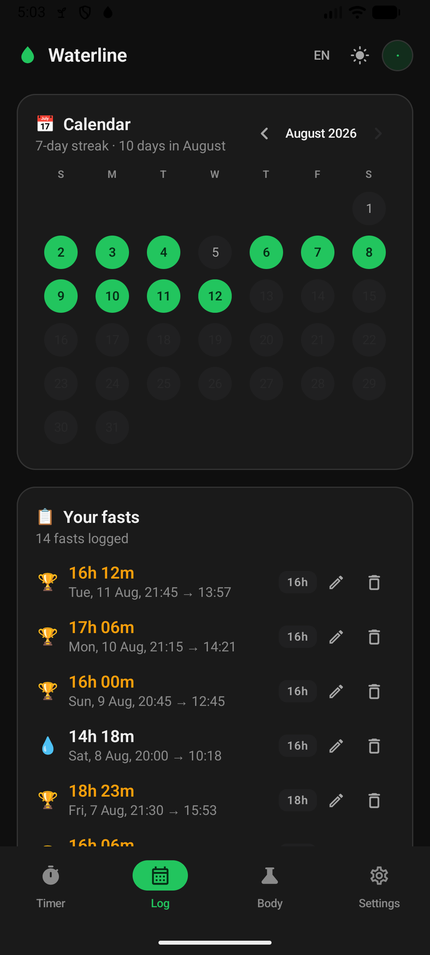 | 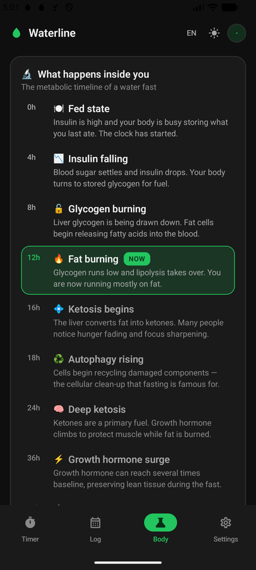 |
| One ring, one number | Streak calendar and every fast | What is happening, right now |

| Lock screen | Notification | Reminder |
|:---:|:---:|:---:|
| 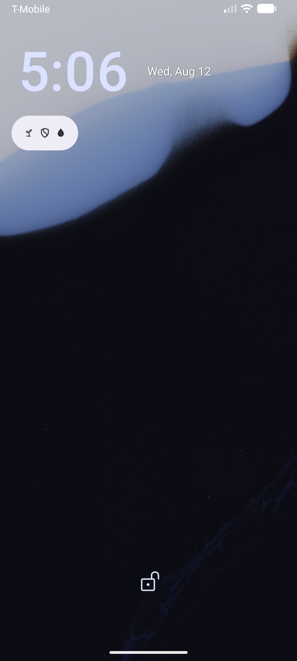 | 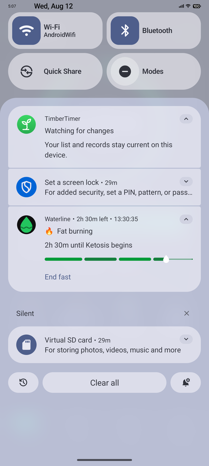 | 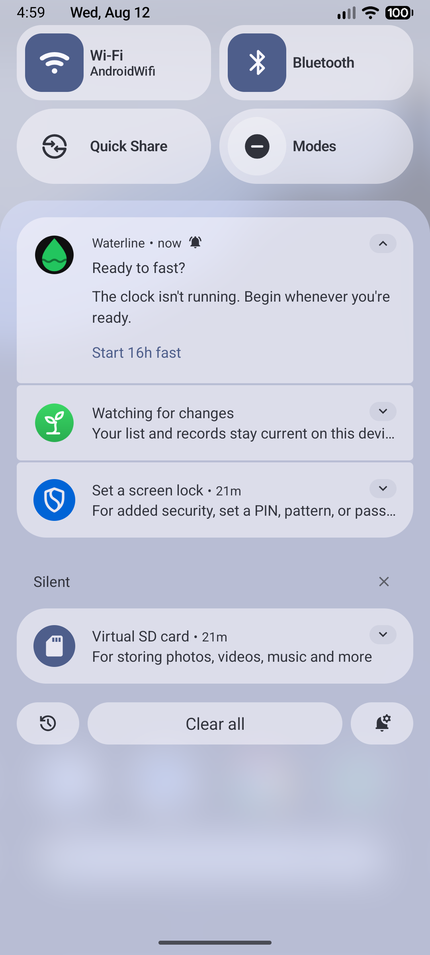 |
| Counts up with the app closed | The goal, split into its stages | Comes back after you swipe it |

| End a fast | Result | Korean | Light |
|:---:|:---:|:---:|:---:|
| 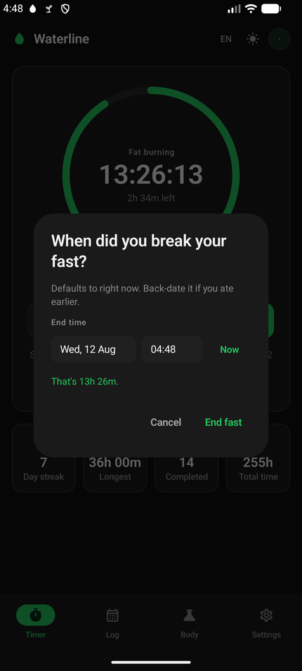 | 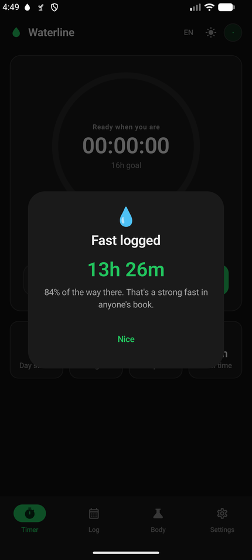 | 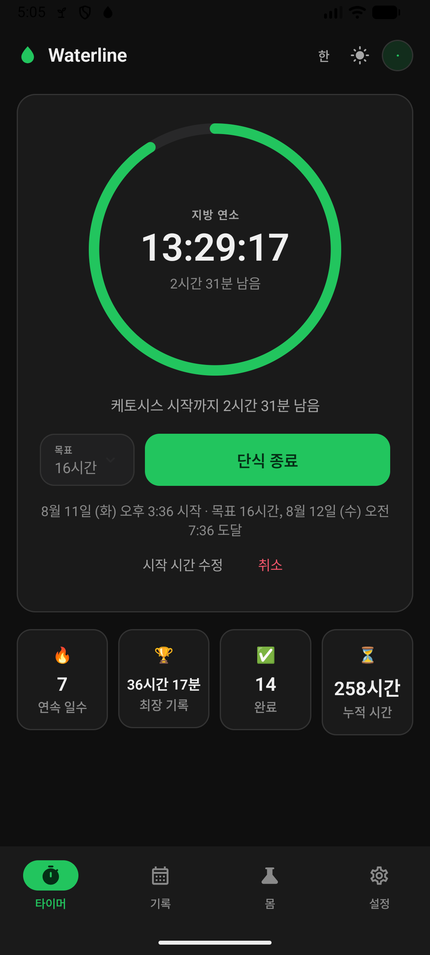 | 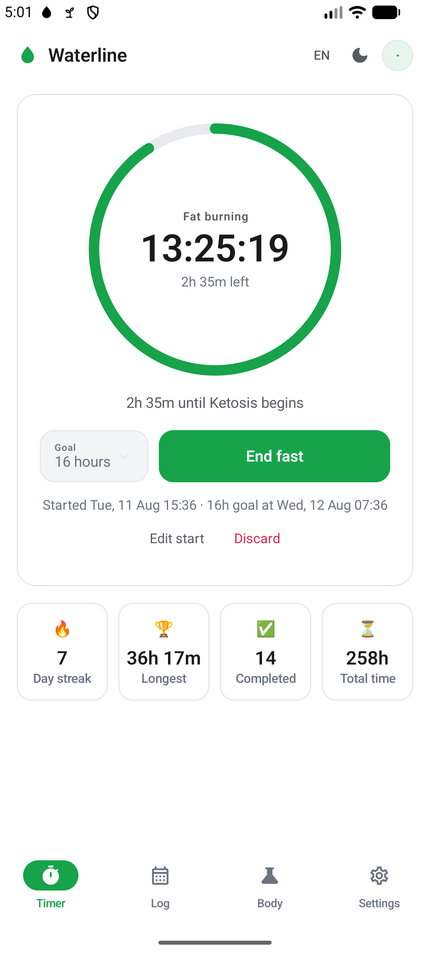 |
| Back-date it if you ate earlier | Tuned to what you did | 한국어 | Same screen, light |

Windows 840dp and wider — a landscape phone, a foldable, a tablet — get the
navigation rail **and** both panes at once, from the same code:

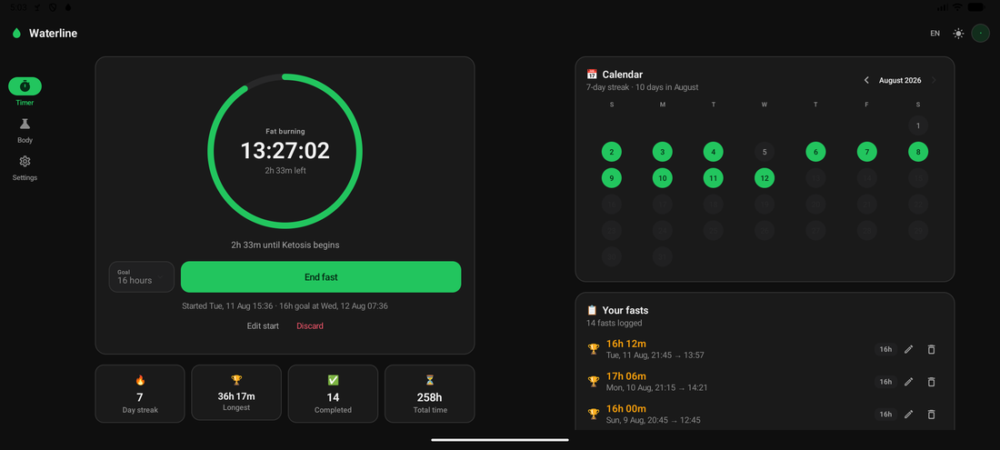

---

## What's in it

Everything the web app does:

- **The ring** — eased, not linear, so the first hour of a 16-hour fast looks
  like something happened
- **Metabolic timeline** — ten stages from *fed state* to *stem cell renewal*,
  with the one you are in marked NOW
- **Streak calendar** and **history**, with any fast editable or deletable
- **Correct the clock** — move a start time you forgot to set, or end a fast at
  the time you actually ate
- **Hide the clock** — one synced switch, and a running fast shows nothing but
  the ring. [See below](#hide-the-clock)
- **Google sign-in** with real-time sync, or no account at all
- **Offline** — everything works with no signal and syncs when you are back
- **Korean and English**, dark and light, dark by default

And what a browser tab cannot do:

- **A live lock-screen timer** that keeps counting for as long as the fast runs
- **Milestone alerts** — ketosis, autophagy, and the moment you hit your goal
- **A reminder to start fasting** that returns after you swipe it away

---

## Hide the clock

Watching a countdown is the surest way to make a fast feel long. **Settings →
The timer → Hide the clock** turns the timer into a game: while a fast is
running you get the ring, the metabolic stage you are in, and a percentage —
and nothing that can be turned back into a time.

| | Clock shown | Clock hidden |
|---|---|---|
| Ring face | `05:36:06` | `35%` |
| Under it | `10h 22m left` | — (`Goal reached` once you pass it) |
| Coach line | `2h 22m until Glycogen burning` | `Next up: Glycogen burning` |
| Goal picker | `Goal · 16 hours`, greyed | put away |
| Below the button | `Started Wed, 12 Aug 16:11 · 16h goal at Thu, 13 Aug 08:11` | put away |
| **Notification** | `Waterline · 10h 22m left`, chronometer ticking | `Waterline · 35%`, no chronometer |
| Milestone alert | *"Twelve hours. You're officially burning fat for fuel."* | *"Glycogen runs low and lipolysis takes over…"* |

**The notification is the hard half, and it is why this is not simply the web
app's feature ported.** On screen everything can be reworded; the elapsed time
in the shade cannot, because SystemUI draws it itself from `setUsesChronometer`
+ `when` and keeps drawing it with no process of ours alive. Left on, a user who
asked not to see a clock gets a live, ticking one on their lock screen — the
most visible place the setting could possibly leak. So both flags come off, the
sub-text becomes the percentage, and the Android 16 status-bar chip shows `35%`
where it showed a countdown. The **stage progress bar stays**: a bar with no
numbers on it is exactly what was asked for.

Four rules keep it honest:

- **Only while a fast is running.** Idle you still see and pick your goal —
  there is nothing to hide yet, and a setting that appears to do nothing is a
  broken setting.
- **Nothing about the fast changes.** It is recorded at its true length, the
  ring still turns amber at the goal, and the completion sheet reveals all of
  it. Hiding is a *view*.
- **The percentage is the real one**, floored and held at 99% until the goal is
  genuinely met — rounding would print `100%` a couple of minutes early and then
  keep counting.
- **There is always a way out.** **Peek**, beside *Edit start*, uncovers
  everything for eight seconds or puts it straight back. The Body tab is left
  alone: the story of what your body is doing is the half worth keeping.

It rides on `settings.hideTimes` in your user document, beside the goal, so the
switch follows the account — flip it in the browser and this phone's
notification rebuilds itself without the app being open. Signed out it lives in
the same local JSON file the web app's `localStorage` mirrors.

### Where it lives in the code

`hideTimes` is a *synced* setting, but the notification is built by an alarm
receiver or a just-woken service with no repository in reach and seconds to
live. So the repository mirrors it into `Prefs` on every state it publishes, and
`Notifications` reads it from there — the same trick already used for the goal,
for the same reason. Mirroring it is also what re-syncs the shade: writing the
pref wakes `Prefs.changes()`, which calls `FastingCoordinator.sync()`.

---

## The clock, when the app is closed

This is the part worth being precise about, because "runs in the background" is
where most Android timers quietly fail.

| Piece | What it does | Survives |
|---|---|---|
| **Chronometer notification** | The elapsed time is drawn by SystemUI from `setUsesChronometer` + `when`. Nothing of ours has to be running for it to keep counting. | Process death, Doze, battery saver, force-stop of everything but the notification itself |
| **Foreground service** (`specialUse`) | Keeps the app out of Doze, makes the notification un-dismissable, and refreshes the countdown, the stage and the progress bar once a minute. | Swiping the app out of recents (`stopWithTask="false"`), screen off, low battery |
| **Exact alarms** | One alarm per upcoming milestone. Each fires, announces what is genuinely new, and books the next. | The app being killed entirely — an alarm restarts it |
| **`BOOT_COMPLETED` receiver** | Rebuilds the notification and every alarm after a reboot or an app update. | Restarts |
| **15-minute WorkManager watchdog** | Reconciles the shade with the stored state and repairs anything missing. | OEM task killers, dropped alarms, a cleared notification |

Four different mechanisms can each rebuild the whole thing from one source of
truth, and all of them call the same `FastingCoordinator.sync()` — so they
cannot half-update the shade by disagreeing with each other.

**Why `specialUse` and not `dataSync`:** since Android 15, `dataSync`
foreground services are capped at six hours a day. A 72-hour fast would be cut
off on the first night. `health` was the other candidate and it demands
body-sensor permissions this app has no use for.

**Why the timer channel is `IMPORTANCE_DEFAULT`:** it never makes a sound —
the channel is created with no sound and no vibration — but it must not be
`IMPORTANCE_LOW` either. Android files low-importance notifications under
*Silent*, and from Android 15 the lock screen **minimises silent notifications
into an icon**. The fasting clock, the one thing this app exists to put on a
lock screen, disappeared from it. This is the kind of bug you only find by
looking at the lock screen.

On **Android 16 and newer** the notification is also a *Live Update*
(`requestPromotedOngoing`): it gets a chip in the status bar, and its progress
bar is drawn with `ProgressStyle` as one segment per metabolic stage, with the
drop riding along it. On older versions it falls back to an ordinary progress
bar and expanded text.

### The reminder that comes back

Swiping a reminder away means *not now*, not *never*. The notification carries
a `deleteIntent`, so dismissing it schedules the next one — after three hours
by default, configurable in Settings, and shifted out of your quiet hours if
you set them. Turning reminders off for good is a switch in Settings, where you
can see what you chose.

This is asserted, not assumed: `NotifyFlowTest` dismisses the notification the
way the system does and checks the next one is booked.

---

## Installing it on your phone

```bash
./gradlew installDebug          # phone plugged in, USB debugging on
```

Or build the APK and copy it across:

```bash
./gradlew assembleDebug         # app/build/outputs/apk/debug/app-debug.apk
```

Open the file on the phone and allow "install unknown apps" for whatever app
you opened it with. The debug build is a normal, fully functional app — it is
just signed with the debug key and not minified.

### What to turn on, once

Open **Settings → Keeping the timer alive**. It shows the live state of four
things Android hides in four different places, and each one is a single tap:

| | Why |
|---|---|
| **Show notifications** | Without it there is no lock-screen timer at all. Asked for on first launch. |
| **Exact alarms** | Milestone alerts land on the minute rather than whenever Doze feels like it. Without it they still arrive, just up to ~9 minutes late. |
| **Unrestricted battery** | Stops an aggressive power manager from freezing the timer mid-fast. **This is the one that matters most on Samsung, Xiaomi, OnePlus and Oppo.** |
| **Alerts through Do Not Disturb** | Optional. Lets milestones and the goal through when DND is on; the running timer is silent either way. |

On Samsung, also check **Settings → Battery → Background usage limits** and make
sure Waterline is not in "Sleeping apps". No app can do that one for you.

---

## Building it

You need Android Studio (or just the SDK) and **JDK 17+**. The project compiles
against SDK 37 and runs on Android 8.0 (API 26) and up.

```bash
./gradlew assembleDebug           # build
./gradlew installDebug            # build + install on a connected device
./gradlew testDebugUnitTest       # the logic tests — no device needed
./gradlew connectedDebugAndroidTest  # the notification tests — needs a device
./gradlew lintDebug               # static analysis
./gradlew assembleRelease         # the real thing — signed and minified
```

> If Gradle picks the wrong JDK, point it at Android Studio's bundled one:
> `JAVA_HOME=~/android-studio/jbr ./gradlew assembleDebug`

**It builds and runs with no setup at all.** Without `google-services.json` the
app simply runs in device-only mode — no sign-in, no sync, everything else
works. That is deliberate: `app/build.gradle.kts` applies the Google Services
plugin *only* when the file exists, so a fresh clone is never broken.

### Why API 26 and not 24

Notification channels, adaptive icons and `java.time` all arrive at API 26, and
every one of them is load-bearing here. Supporting Android 7 would mean core
library desugaring plus a second code path through the notification stack, for
a share of devices now well under one percent.

---

## Release builds

`assembleRelease` produces an R8-minified APK — **2.8 MB against the debug
build's 27 MB**, and without the debug build's `debuggable` flag. Signing
credentials come from a gitignored `keystore.properties` next to the root build
file:

```properties
storeFile=waterline-release.jks
storePassword=…
keyAlias=waterline
keyPassword=…
```

Without that file (or without the `.jks` it names) the project still builds;
release just comes out unsigned, which is the honest outcome rather than a
confusing failure. Generate a key with:

```bash
keytool -genkeypair -v -keystore waterline-release.jks -alias waterline \
  -keyalg RSA -keysize 4096 -validity 10000
```

> **Back the `.jks` up somewhere private.** Unlike the Firebase keys it really
> is a secret, and it is unrecoverable: Android only accepts an update signed
> by the same key, so losing it means every installed copy has to be
> uninstalled and reinstalled from scratch.

Add the release key's SHA-1 to Firebase alongside the debug one, or sign-in
works in debug and fails in release:

```bash
keytool -list -v -alias waterline -keystore waterline-release.jks | grep SHA1
```

Two things minification needs, both documented where they live rather than
here: `res/raw/keep.xml` keeps `default_web_client_id`, which is read by name
and is therefore invisible to the resource shrinker, and
`keepRules/rules.keep` keeps the `WorkManager` worker constructor, which is
called reflectively.

---

## Turning on Google sign-in + sync

Use the **same Firebase project as the web app** so both clients read the same
fasts. If you followed the web README, it is `waterline-af54d`.

### 1. Register the Android app in Firebase

1. Firebase console → your project → gear icon → **Project settings**
2. **Your apps** → **Add app** → Android
3. **Package name:** `com.hanifedma.waterline` — it must match exactly
4. **Debug signing certificate SHA-1** — required, or Google sign-in fails:

   ```bash
   keytool -list -v -alias androiddebugkey \
     -keystore ~/.android/debug.keystore \
     -storepass android -keypass android | grep SHA1
   ```

   Paste the SHA-1, and add the release keystore's too — see
   [Release builds](#release-builds). A fingerprint is per signing key *and*
   per machine, so a checkout on a second computer needs its own added.
5. Download **`google-services.json`** and drop it in **`app/`**
6. Rebuild. The Account card in Settings offers sign-in on the next launch.

### 2. That's it

No new Firestore rules are needed. The Android app writes exactly the documents
the web rules already cover:

```
users/{uid}                 { activeFast: { start, goalHours } | null,
                              settings: { goalHours, hideTimes } }
users/{uid}/fasts/{fastId}  { start, end, goalHours }
```

The rules reject any fast whose keys are not exactly `start`, `end` and
`goalHours`, so the app writes those three and nothing else — no "source:
android" field, however tempting.

> **Why the SHA-1 matters:** Google sign-in on Android identifies your app by
> its signing certificate, not by a secret. Skip it and sign-in fails with a
> vague error even though everything else looks right.

---

## Adaptive layout

The window's width decides the layout, not "phone vs tablet" — so it is also
right for a landscape phone, a foldable, and split-screen:

| Width | Layout |
|---|---|
| < 600dp | Bottom navigation bar, one pane |
| 600–840dp | Navigation rail, one pane |
| ≥ 840dp | Navigation rail **and** the timer beside the log |

---

## How the code is laid out

```
core/       Fasting.kt     Pure domain logic — days, streaks, stats, the ring curve
            Stages.kt      The metabolic timeline and the copy that goes with it
            Format.kt      Every number the app prints, in the chosen locale
data/       FastStore.kt   One interface, two backends
            CloudStore.kt  Firestore, real-time, offline-queued
            LocalStore.kt  A JSON file in the web app's exact shape; no account needed
            FastingRepository.kt  Which backend is in charge, and the guest → account merge
            Prefs.kt       Device settings, and the mirror the background half reads
auth/       AuthManager.kt Google sign-in via Credential Manager
i18n/       Strings.kt     Korean + English
notify/     FastingCoordinator.kt  The one description of what the shade should look like
            TimerService.kt        The foreground service
            Notifications.kt       Every notification, built in one place
            Alarms.kt              Milestones, the nudge, and quiet hours
            AlarmReceiver.kt       What happens when the app is not on screen
            BootReceiver.kt        Putting it all back after a reboot
            WatchdogWorker.kt      The 15-minute repair pass
ui/         WaterlineRoot.kt  The adaptive shell
            screens/       Timer, log, body, settings, dialogs
            theme/         The web app's palette, verbatim
```

### Notes on some decisions

**`core/Fasting.kt` is a port of the web app's `store.js` statistics,** and
`FastingTest` pins the rules both clients have to agree on. Both agreeing on
what a streak *is* matters more than either being clever.

**Days are compared by ordinal, never by subtracting timestamps.** Across a
daylight-saving boundary two consecutive local midnights are 23 or 25 hours
apart, which would silently break a streak twice a year. The tests run in Seoul
and New York to prove it.

**Firestore writes are never awaited.** The task they return only completes
when the *server* acknowledges, so awaiting it hangs forever offline — ending a
fast would look like it did nothing even though it is already saved and queued.

**The running fast is mirrored into SharedPreferences.** The alarm receiver,
the boot receiver and the service all wake with no repository and no coroutine
scope, and the first has five seconds to post a notification before Android
kills the app. The mirror is a cache, though — when it and the store disagree,
the store wins.

**The service waits for the store before it acts on an empty state.** For a
signed-in user the local file is empty, so for a few hundred milliseconds on a
cold start "no fast is running" is a lie. Acting on it cancelled the
notification, stopped the service and wiped the mirror — a bug found by writing
the test above, not by using the app.

**The ring is eased by `p^0.55`; nothing numeric is.** The clock, the countdown
and every statistic are the real values. Only the drawn arc is flattered.

---

## Tests

```bash
./gradlew testDebugUnitTest          # 23 logic tests, no device
./gradlew connectedDebugAndroidTest  # 8 notification tests, needs a device
```

The logic tests cover streaks across DST and time zones, the clamping rules
that keep a fast inside what `firestore.rules` will accept, stage boundaries,
the ring curve, and the hidden percentage's floor. The instrumented tests cover
the promises above: the clock appears, the clock goes away, the nudge returns
after a swipe, a milestone is announced exactly once — and that hiding the
clock takes it off the lock screen as well as off the timer screen, which is
the one part of that feature no unit test can see.

---

## Health note

Waterline is an informational tool, not medical advice. Extended water fasting
can be dangerous if you are pregnant or breastfeeding, underweight, diabetic,
on medication, or have a history of disordered eating. Talk to a doctor before
fasts longer than 24 hours, and stop immediately if you feel faint, confused,
or unwell.
